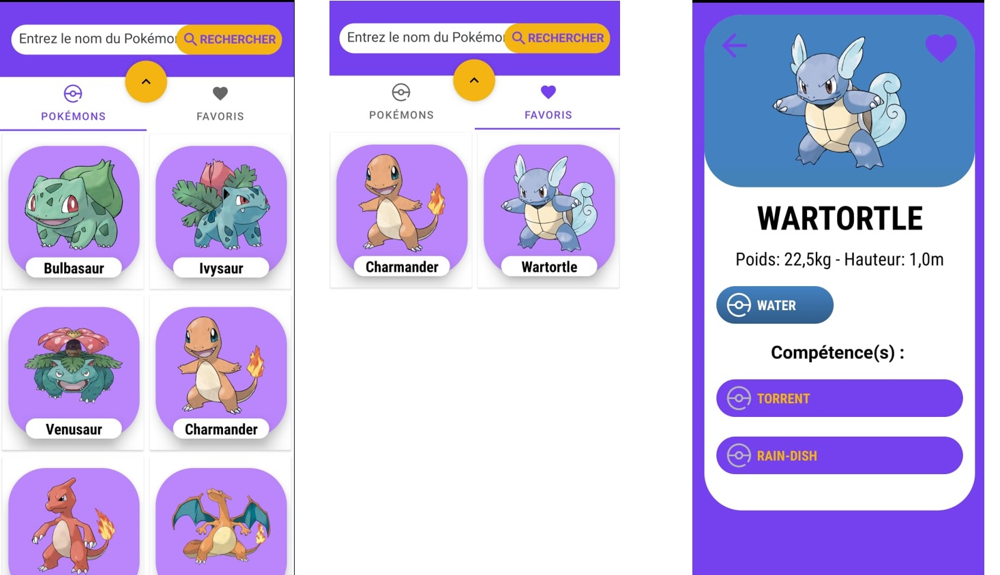
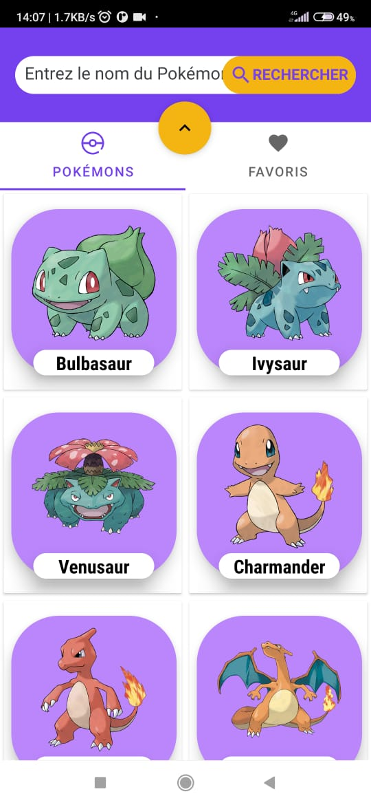
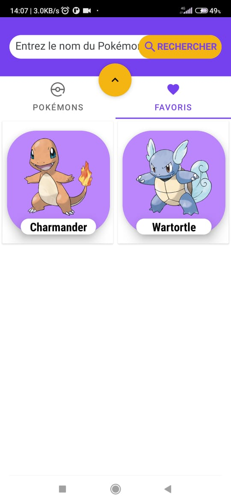
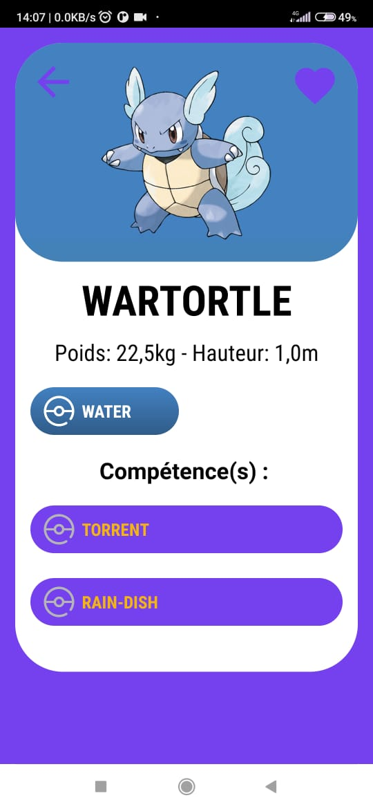

# Controle " Pokedex avec API "

## Réaliser par :

**MAZZOUZ CHAIMAE**

**BOUTISSANTE ISSAM**

## Exécution de l'application :

[Regardez cette vidéo](https://drive.google.com/file/d/1DHbUKF73n12sX7TIh3_qNjgU73vtCR5f/view?usp=sharing)

## Fonctionnalités:

⚡️ L'application Pokédex possède **la liste complète et mise à jour des pokémons**, il est possible d'élargir les **détails d'un pokémon** en cliquant sur son image. L'application permet également de **rechercher des pokémons** dans la liste par nom complet ou partiel

⚡️ Vous êtes allé trop loin dans la liste ?... Vous n'avez pas besoin de faire défiler toute la page vers le haut pour revenir au début, vous pouvez utiliser un seul **bouton de flèche vers le haut (^) sur l'écran pour revenir au début de la liste** instantanément !

⚡️ Vous avez terminé votre recherche ou la visualisation des informations et vous souhaitez revenir à la liste principale ?... En cliquant sur les **boutons de l'écran X ou de retour en arrière (<-)**, il est possible de **retourner au début** de votre parcours !

⚡️ Vous avez accédé à la liste et vous avez perdu la connexion ?... Pas de problème, l'application **enregistre automatiquement** un ensemble de Pokémons de la liste pour que vous puissiez y accéder et vous donne également la possibilité de **glisser vers le haut** pour recharger votre liste à nouveau lorsque vous avez une connexion !

⚡️ Vous avez trouvé un Pokémon que vous aimeriez accéder à nouveau plus tard ? Vous pouvez le marquer comme favori en cliquant sur l'icône en forme de cœur qui apparaît une fois que vous avez élargi ses informations, et le retrouver dans votre liste de Pokémon favoris.

# les Pages:

## Page qui contiennet la liste des pokemon

## Page qui contiennet la liste des pokemon favoris

## Page qui contiennet les information de pokemon

